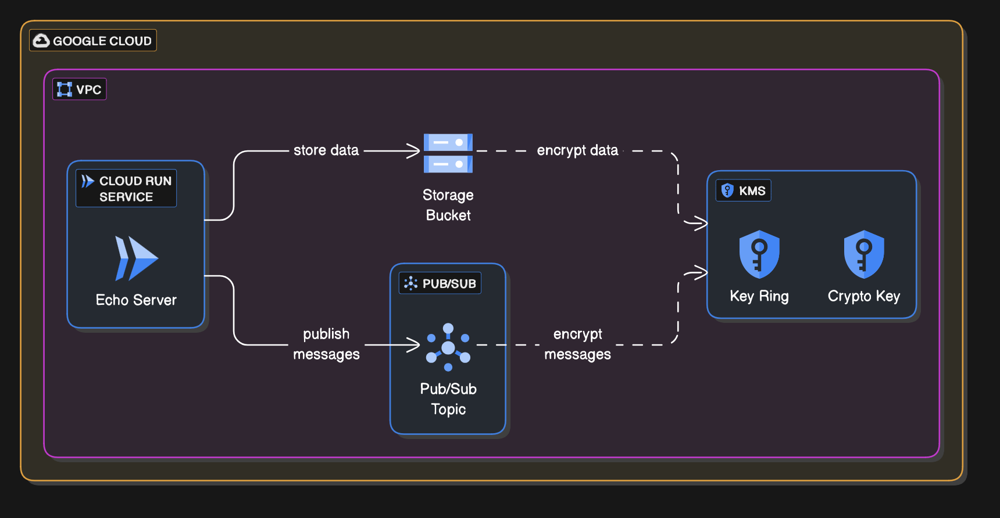

# gcp-sample-deployment
Sample deployment to GCP Cloud Run for an API endpoint

## Purpose of this repository
The purpose of this repository is to demonstrate a working knowledge of Terraform, it's scalability with modules, as well as my understanding of important supporting aspects, such as monitoring, security and ease-of-use.

## Requirements (paraphrased)
Deploy an API endpoint, as well as supporting infrastructure and access, such as a bucket and a message bus.

## Architectural design
This diagram was generated by AI at https://app.eraser.io

## My thought process
This section will describe how I'm going through this 

### Why choosing Cloud Run
Kubernetes is too complex to set up for a single, simple application. It's better when used and owned by a team that can provide the platform to the developers.

There's a similar thought when considering Compute, in that standing up a VM actually takes a lot, and is better when there's a setup in place to streamline security updates, ssh configurations, and monitoring.

Cloud Run seems to fit the bill, but I have not found yet if I can have Cloud Run access pubsub services and buckets without going over the internet. In AWS, it'd be something similar to a vpc endpoint.

### Why choosing standard storage for the bucket
When an application takes a document and publishes to a message bus, it's likely that a second application (aka worker) will take that document and do something with it. Coldline, Nearline and Archive storage would cost more with their minimum stored duration requirements, than Standard would with the assumption that the object could be safely deleted relatively soon, once the worker has finished with it.

I could have chosen "REGIONAL", to fit the vibe of the rest of the project, but I would assume that choosing `location = "europe-west4"` in the bucket would make it default regional. I had other things to spend time on than look into that, such as figuring out how IAM really worked in GCP.

### Initial todo:
1. ~~Copy a hello world app in Go to use as a test subject. Ignore lack of tests.~~ Use an echoserver container image from Dockerhub.
1. Create a project in GCP to deploy this to.
1. Do some quick Terraform writing to create a VPC, the bucket, the message bus, ~~all privately accessible~~. Possibly use public modules.
1. Look more into Cloud Run, ~~determine if an API Gateway is necessary, and determine if there is security functionality such as a WAF that can be paired with it.~~
1. Look into visibility metrics and native support in GCP for out of the box monitoring and logging.
1. ~~Determine if necessary to create an image registry for the container image to run on Cloud Run.~~
1. Build out the Terraform for the Cloud Run function, ~~image support, API Gateway LB/WAF (if necessary) and logging and metric support.~~
1. Build out service account for Cloud Run function, with access to KMS key, bucket and message bus.
1. ~~Determine if there's a way to ensure private access to bucket, message bus and KMS service so traffic isn't going out and back in to GCP.~~

### Things I'd like to do, but probably won't have time to do:
1. Ability to create a custom service account that only has access to deploy what is necessary.
1. Build a pipeline that includes auto-building the container image (if necessary) and deploying the infrastructure. These repositories could also be split up, so developing the app happens in one repository and supporting infrastructure is deployed in another. I'm not sure which is exactly the best route, due to my unfamiliarity with specific deployment strategies in Cloud Run.
1. Creating a re-usable module for anyone to run container workloads on Cloud Run, with built in logging and metric support (and maybe a container registry).
1. Determining best key algorithm for KMS key, and ensuring that it will work without the need for software to decrypt.
1. Determine what annotations or settings should be used in order to optimize or scale deployment for production workloads.
1. Figure out how to automatically enable APIs with new projects.
1. Set up a load balancer with WAF on a public-facing subnet in order to filter malicious traffic.
1. Visibility, such as logging and metrics, for the cloud run function.
1. Put cloud run function, pubsub, and bucket in a private VPC with endpoints to access and not make calls out to the internet.